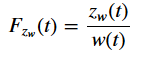

# Analiza i modelowanie sterowanych amortyzatorów hydraulicznych

## Cel i zakres pracy

Celem pracy jest wykonanie skryptów do automatyzacji analizy danych pomiarowych. Dane pomiarowe zapisywane są w plikach _*.tdms_.
Badania przeprowadzone zostały w laboratorium "Układów i Struktur Dynamicznych" w KAP.  
Skrypty umożliwiają określenie charakterystyk:
1. Statycznych
2. Dynamicznych

Drugim etapem pracy jest zamodelowanie testowanych układów oraz przeprowadzenie symulacji.

## Model ćwiartkowy zawieszenia pojazdu kołowego

&nbsp;

Na powyższym rysunku przedstawiony został model obliczeniowy ćwiartkowego, pasywnego układu zawieszenia pojazdu kołowego. Przyjęto oznaczenia:

&nbsp;

## Charakterystyki statyczne

### Wykres siły od przemieszczenia

&nbsp;

### Wykres pracy od częstotliwości wymuszczenia

&nbsp;

### Wykres siły od prędkości

&nbsp;

### Aproksymacja siły od prędkości

&nbsp;

## Charakterystyki dynamiczne

### Funkcje przenoszenia drgań

&nbsp;

### Przemieszczeniowa funkcja przenoszenia drgań masy wibroizolowanej 

&nbsp;
&nbsp;

### Przyspieszeniowa funkcja przenoszenia drgań masy wibroizolowanej 

&nbsp;
&nbsp;

### Przemieszczeniowa funkcja przenoszenia drgań masy niewibroizolowanej 

&nbsp;
&nbsp;

### Funkcja przenoszenia drgań ugięcia zawieszenia 

&nbsp;
&nbsp;

### Funkcja przenoszenia drgań ugięcia opony

&nbsp;
&nbsp;